# ADM-HW2


```python
import pandas as pd
import json
import matplotlib.pyplot as plt

# OPENING THE FILES (IF YOU PASTE ON JUPYTER NOTEBOOK UPLOAD THE FILES AND JUST PUT 'matches-England.json" AS PATH)
with open('matches_England.json') as json_file:
    jmatches = json.load(json_file)

with open('teams.json') as json_file:
    jteams = json.load(json_file)
    
with open('events_England.json') as json_file:
    jevents = json.load(json_file)
    
with open('players.json') as json_file:
    play = json.load(json_file)
    
    
# CREATING DATA FRAME FROM FILES
match = pd.DataFrame(jmatches)
teams = pd.DataFrame(jteams)
events = pd.DataFrame(jevents)
plyer =  pd.DataFrame(play) 
```


```python
#pd.read_json('matches_England.json')
# from pandas.io.json import json_normalize
# json_normalize(jmatches, 'teamsData')
```


```python
# make the time intervals

def eventtime(matchPeriod, eventSec):

    import math
    if math.ceil(eventSec/60)>45:
        if matchPeriod == '1H':
            return '45+'
        else:
            return '90+'
    elif matchPeriod == '2H':
        return math.floor(math.ceil(eventSec/60)/10+4.5)
    else:
        return math.floor(math.ceil(eventSec/60)/10)
    
    
    
events['timeintervals'] = events.apply(lambda x: eventtime(x['matchPeriod'], x['eventSec']), axis=1)
```


```python
## find the goals
def goals(x):
    
    for i in x:
        if i['id']==101:
            return 1
        
events['golas'] = events['tags'].apply(goals)
```


```python
goaltime = events[['timeintervals','golas']]
```


```python
goaltime.dropna(axis=0, how='any', inplace= True)
```

    C:\ProgramData\Anaconda3\lib\site-packages\ipykernel_launcher.py:1: SettingWithCopyWarning: 
    A value is trying to be set on a copy of a slice from a DataFrame
    
    See the caveats in the documentation: http://pandas.pydata.org/pandas-docs/stable/user_guide/indexing.html#returning-a-view-versus-a-copy
      """Entry point for launching an IPython kernel.
    


```python
## goaltime.groupby('timeintervals' ).size().plot.bar()
```


```python
## goaltime.groupby('timeintervals').sum().plot.bar()
```


```python
ss = pd.DataFrame(goaltime['timeintervals'].value_counts(), index=[0, 1, 2, 3, 4, '45+', 5, 6, 7, 8, 9, '90+'] )
import seaborn as sns

sns.barplot(ss.index , y = ss['timeintervals'] , data = ss, palette = 'Dark2' )
```


    <matplotlib.axes._subplots.AxesSubplot at 0xfcaca08cf8>


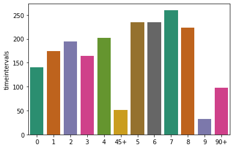


```python
ss.plot.bar()
```


    <matplotlib.axes._subplots.AxesSubplot at 0xfcacb7a940>


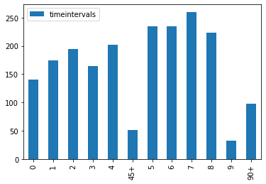


```python
## goaltime['timeintervals'].value_counts().plot.bar()
```


```python
events[['teamId', 'timeintervals','golas']].groupby('timeintervals').get_group(8).groupby('teamId').sum().sort_values(by=['golas'], ascending = False).head(10)
```


<div>
<style scoped>
    .dataframe tbody tr th:only-of-type {
        vertical-align: middle;
    }

    .dataframe tbody tr th {
        vertical-align: top;
    }

    .dataframe thead th {
        text-align: right;
    }
</style>
<table border="1" class="dataframe">
  <thead>
    <tr style="text-align: right;">
      <th></th>
      <th>golas</th>
    </tr>
    <tr>
      <th>teamId</th>
      <th></th>
    </tr>
  </thead>
  <tbody>
    <tr>
      <td>1625</td>
      <td>15.0</td>
    </tr>
    <tr>
      <td>1609</td>
      <td>14.0</td>
    </tr>
    <tr>
      <td>1644</td>
      <td>14.0</td>
    </tr>
    <tr>
      <td>1633</td>
      <td>14.0</td>
    </tr>
    <tr>
      <td>1623</td>
      <td>13.0</td>
    </tr>
    <tr>
      <td>1624</td>
      <td>13.0</td>
    </tr>
    <tr>
      <td>1628</td>
      <td>13.0</td>
    </tr>
    <tr>
      <td>1610</td>
      <td>12.0</td>
    </tr>
    <tr>
      <td>1611</td>
      <td>12.0</td>
    </tr>
    <tr>
      <td>1659</td>
      <td>12.0</td>
    </tr>
  </tbody>
</table>
</div>


```python
plyergoal = events[['playerId', 'timeintervals','golas']].dropna(axis=0, how='any')
```


```python
# Find the players ID with at leat one goal at 8 intervals
plyid = plyergoal.groupby('playerId').agg(lambda x: len(x['timeintervals'].value_counts())>=8).groupby('timeintervals').get_group(True).index
```


```python
pd.merge(pd.pivot_table(plyergoal, columns= 'timeintervals', index='playerId', values='golas', aggfunc = sum).dropna(axis=0,thresh=8 ), plyer[plyer['wyId'].apply(lambda x: x in plyid)==True][['wyId', 'shortName']].set_index('wyId'),left_index=True,right_index=True).head()
```


<div>
<style scoped>
    .dataframe tbody tr th:only-of-type {
        vertical-align: middle;
    }

    .dataframe tbody tr th {
        vertical-align: top;
    }

    .dataframe thead th {
        text-align: right;
    }
</style>
<table border="1" class="dataframe">
  <thead>
    <tr style="text-align: right;">
      <th></th>
      <th>0</th>
      <th>1</th>
      <th>2</th>
      <th>3</th>
      <th>4</th>
      <th>5</th>
      <th>6</th>
      <th>7</th>
      <th>8</th>
      <th>9</th>
      <th>45+</th>
      <th>90+</th>
      <th>shortName</th>
    </tr>
  </thead>
  <tbody>
    <tr>
      <td>54</td>
      <td>1.0</td>
      <td>NaN</td>
      <td>NaN</td>
      <td>NaN</td>
      <td>3.0</td>
      <td>1.0</td>
      <td>2.0</td>
      <td>1.0</td>
      <td>1.0</td>
      <td>NaN</td>
      <td>1.0</td>
      <td>1.0</td>
      <td>C. Eriksen</td>
    </tr>
    <tr>
      <td>3324</td>
      <td>1.0</td>
      <td>1.0</td>
      <td>NaN</td>
      <td>2.0</td>
      <td>3.0</td>
      <td>1.0</td>
      <td>1.0</td>
      <td>1.0</td>
      <td>1.0</td>
      <td>NaN</td>
      <td>NaN</td>
      <td>NaN</td>
      <td>\u00c1lvaro Morata</td>
    </tr>
    <tr>
      <td>3429</td>
      <td>1.0</td>
      <td>2.0</td>
      <td>3.0</td>
      <td>2.0</td>
      <td>5.0</td>
      <td>2.0</td>
      <td>9.0</td>
      <td>2.0</td>
      <td>3.0</td>
      <td>1.0</td>
      <td>1.0</td>
      <td>3.0</td>
      <td>T. Courtois</td>
    </tr>
    <tr>
      <td>3582</td>
      <td>2.0</td>
      <td>2.0</td>
      <td>4.0</td>
      <td>2.0</td>
      <td>2.0</td>
      <td>7.0</td>
      <td>3.0</td>
      <td>4.0</td>
      <td>2.0</td>
      <td>NaN</td>
      <td>NaN</td>
      <td>1.0</td>
      <td>Adri\u00e1n</td>
    </tr>
    <tr>
      <td>7847</td>
      <td>3.0</td>
      <td>7.0</td>
      <td>5.0</td>
      <td>5.0</td>
      <td>6.0</td>
      <td>8.0</td>
      <td>6.0</td>
      <td>5.0</td>
      <td>7.0</td>
      <td>3.0</td>
      <td>1.0</td>
      <td>NaN</td>
      <td>\u0141. Fabia\u0144ski</td>
    </tr>
  </tbody>
</table>
</div>


```python
plt.figure(figsize=(20,6))
pd.merge(pd.pivot_table(plyergoal, columns= 'timeintervals', index='playerId', values='golas', aggfunc = sum).dropna(axis=0,thresh=8 ), plyer[plyer['wyId'].apply(lambda x: x in plyid)==True][['wyId', 'shortName']].set_index('wyId'),left_index=True,right_index=True).set_index('shortName').count(axis=1).plot.bar()
plt.ylabel('timeintervals')
plt.title('Number of unique timeintervals each player have a goal')
plt.show()
```


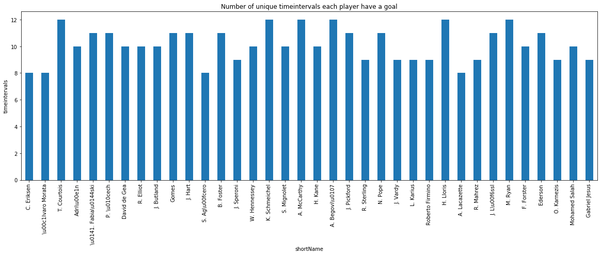


```python
ee =pd.merge(pd.pivot_table(plyergoal, columns= 'timeintervals', index='playerId', values='golas', aggfunc = sum).dropna(axis=0,thresh=8 ), plyer[plyer['wyId'].apply(lambda x: x in plyid)==True][['wyId', 'shortName']].set_index('wyId'),left_index=True,right_index=True).set_index('shortName').count(axis=1)
fig = plt.figure(figsize=(20,6))
ax = plt.subplot(111)
ax = sns.barplot(ee.keys() , ee.values, ax = ax )
ax.set_xticklabels(ax.get_xticklabels(),rotation=30,  ha='right')
plt.show()
```


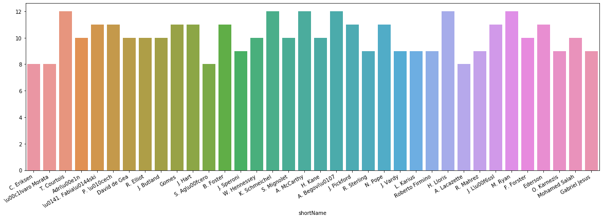


```python
ee.values
```


    array([ 8,  8, 12, 10, 11, 11, 10, 10, 10, 11, 11,  8, 11,  9, 10, 12, 10,
           12, 10, 12, 11,  9, 11,  9,  9,  9, 12,  8,  9, 11, 12, 10, 11,  9,
           10,  9], dtype=int64)


```python
plyer[plyer['wyId'].apply(lambda x: x in plyid)==True][['wyId', 'shortName']].set_index('wyId').head(7)
```


<div>
<style scoped>
    .dataframe tbody tr th:only-of-type {
        vertical-align: middle;
    }

    .dataframe tbody tr th {
        vertical-align: top;
    }

    .dataframe thead th {
        text-align: right;
    }
</style>
<table border="1" class="dataframe">
  <thead>
    <tr style="text-align: right;">
      <th></th>
      <th>shortName</th>
    </tr>
    <tr>
      <th>wyId</th>
      <th></th>
    </tr>
  </thead>
  <tbody>
    <tr>
      <td>54</td>
      <td>C. Eriksen</td>
    </tr>
    <tr>
      <td>71654</td>
      <td>Ederson</td>
    </tr>
    <tr>
      <td>7847</td>
      <td>\u0141. Fabia\u0144ski</td>
    </tr>
    <tr>
      <td>7910</td>
      <td>David de Gea</td>
    </tr>
    <tr>
      <td>8094</td>
      <td>J. Butland</td>
    </tr>
    <tr>
      <td>8325</td>
      <td>S. Ag\u00fcero</td>
    </tr>
    <tr>
      <td>8480</td>
      <td>K. Schmeichel</td>
    </tr>
  </tbody>
</table>
</div>


```python
# players name with at leat one goal at 8 intervals
plyer[plyer['wyId'].apply(lambda x: x in plyid)==True][['firstName','lastName','shortName']].head()
```


<div>
<style scoped>
    .dataframe tbody tr th:only-of-type {
        vertical-align: middle;
    }

    .dataframe tbody tr th {
        vertical-align: top;
    }

    .dataframe thead th {
        text-align: right;
    }
</style>
<table border="1" class="dataframe">
  <thead>
    <tr style="text-align: right;">
      <th></th>
      <th>firstName</th>
      <th>lastName</th>
      <th>shortName</th>
    </tr>
  </thead>
  <tbody>
    <tr>
      <td>9</td>
      <td>Christian</td>
      <td>Dannemann Eriksen</td>
      <td>C. Eriksen</td>
    </tr>
    <tr>
      <td>568</td>
      <td>Ederson</td>
      <td>Santana de Moraes</td>
      <td>Ederson</td>
    </tr>
    <tr>
      <td>654</td>
      <td>\u0141ukasz</td>
      <td>Fabia\u0144ski</td>
      <td>\u0141. Fabia\u0144ski</td>
    </tr>
    <tr>
      <td>673</td>
      <td>David</td>
      <td>de Gea Quintana</td>
      <td>David de Gea</td>
    </tr>
    <tr>
      <td>700</td>
      <td>Jack</td>
      <td>Butland</td>
      <td>J. Butland</td>
    </tr>
  </tbody>
</table>
</div>


```python
# second approch to find the players ID who have goals in 8 intervals 
d ={}
for  x,y in dict(plyergoal.groupby(['playerId','timeintervals']).size()).keys():
    d.setdefault(x, []).append(y)

plys =[]

for i in d:
    if len(d[i])>=8:
        plys.append(i)
print('Number of players with goals at 8 or more intervals: ', len(plys ) )      
```

    Number of players with goals at 8 or more intervals:  36
    

## CRQ2


```python
with open('matches_Spain.json') as json_file:
    spmatches = json.load(json_file)
    
with open('events_Spain.json') as json_file:
    spevent = json.load(json_file)

    
spmatch = pd.DataFrame(spmatches)
spevents = pd.DataFrame(spevent)    
```


```python
##  Barcelona - Real Madrid played on the 6 May 2018
spmatch[spmatch['label']=='Barcelona - Real Madrid, 2 - 2']

```


<div>
<style scoped>
    .dataframe tbody tr th:only-of-type {
        vertical-align: middle;
    }

    .dataframe tbody tr th {
        vertical-align: top;
    }

    .dataframe thead th {
        text-align: right;
    }
</style>
<table border="1" class="dataframe">
  <thead>
    <tr style="text-align: right;">
      <th></th>
      <th>status</th>
      <th>roundId</th>
      <th>gameweek</th>
      <th>teamsData</th>
      <th>seasonId</th>
      <th>dateutc</th>
      <th>winner</th>
      <th>venue</th>
      <th>wyId</th>
      <th>label</th>
      <th>date</th>
      <th>referees</th>
      <th>duration</th>
      <th>competitionId</th>
    </tr>
  </thead>
  <tbody>
    <tr>
      <td>23</td>
      <td>Played</td>
      <td>4406122</td>
      <td>36</td>
      <td>{'675': {'scoreET': 0, 'coachId': 275283, 'sid...</td>
      <td>181144</td>
      <td>2018-05-06 18:45:00</td>
      <td>0</td>
      <td>Camp Nou</td>
      <td>2565907</td>
      <td>Barcelona - Real Madrid, 2 - 2</td>
      <td>May 6, 2018 at 8:45:00 PM GMT+2</td>
      <td>[{'refereeId': 378950, 'role': 'referee'}, {'r...</td>
      <td>Regular</td>
      <td>795</td>
    </tr>
  </tbody>
</table>
</div>


```python
spmatches[23]
```


    {'status': 'Played',
     'roundId': 4406122,
     'gameweek': 36,
     'teamsData': {'675': {'scoreET': 0,
       'coachId': 275283,
       'side': 'away',
       'teamId': 675,
       'score': 2,
       'scoreP': 0,
       'hasFormation': 1,
       'formation': {'bench': [{'playerId': 282441,
          'ownGoals': '0',
          'redCards': '0',
          'goals': 'null',
          'yellowCards': '0'},
         {'playerId': 344132,
          'ownGoals': '0',
          'redCards': '0',
          'goals': 'null',
          'yellowCards': '0'},
         {'playerId': 326523,
          'ownGoals': '0',
          'redCards': '0',
          'goals': 'null',
          'yellowCards': '0'},
         {'playerId': 3785,
          'ownGoals': '0',
          'redCards': '0',
          'goals': 'null',
          'yellowCards': '0'},
         {'playerId': 288091,
          'ownGoals': '0',
          'redCards': '0',
          'goals': 'null',
          'yellowCards': '0'},
         {'playerId': 69404,
          'ownGoals': '0',
          'redCards': '0',
          'goals': 'null',
          'yellowCards': '0'},
         {'playerId': 4498,
          'ownGoals': '0',
          'redCards': '0',
          'goals': 'null',
          'yellowCards': '0'}],
        'lineup': [{'playerId': 3322,
          'ownGoals': '0',
          'redCards': '0',
          'goals': '1',
          'yellowCards': '0'},
         {'playerId': 3304,
          'ownGoals': '0',
          'redCards': '0',
          'goals': 'null',
          'yellowCards': '12'},
         {'playerId': 14723,
          'ownGoals': '0',
          'redCards': '0',
          'goals': 'null',
          'yellowCards': '0'},
         {'playerId': 40756,
          'ownGoals': '0',
          'redCards': '0',
          'goals': 'null',
          'yellowCards': '0'},
         {'playerId': 3309,
          'ownGoals': '0',
          'redCards': '0',
          'goals': 'null',
          'yellowCards': '31'},
         {'playerId': 3310,
          'ownGoals': '0',
          'redCards': '0',
          'goals': 'null',
          'yellowCards': '77'},
         {'playerId': 3321,
          'ownGoals': '0',
          'redCards': '0',
          'goals': 'null',
          'yellowCards': '0'},
         {'playerId': 3306,
          'ownGoals': '0',
          'redCards': '0',
          'goals': 'null',
          'yellowCards': '44'},
         {'playerId': 8287,
          'ownGoals': '0',
          'redCards': '0',
          'goals': 'null',
          'yellowCards': '0'},
         {'playerId': 8278,
          'ownGoals': '0',
          'redCards': '0',
          'goals': '1',
          'yellowCards': '77'},
         {'playerId': 3915,
          'ownGoals': '0',
          'redCards': '0',
          'goals': 'null',
          'yellowCards': '0'}],
        'substitutions': [{'playerIn': 288091, 'playerOut': 3322, 'minute': 46},
         {'playerIn': 4498, 'playerOut': 3304, 'minute': 68},
         {'playerIn': 69404, 'playerOut': 14723, 'minute': 84}]},
       'scoreHT': 1},
      '676': {'scoreET': 0,
       'coachId': 92894,
       'side': 'home',
       'teamId': 676,
       'score': 2,
       'scoreP': 0,
       'hasFormation': 1,
       'formation': {'bench': [{'playerId': 286390,
          'ownGoals': '0',
          'redCards': '0',
          'goals': 'null',
          'yellowCards': '0'},
         {'playerId': 7860,
          'ownGoals': '0',
          'redCards': '0',
          'goals': 'null',
          'yellowCards': '0'},
         {'playerId': 33,
          'ownGoals': '0',
          'redCards': '0',
          'goals': 'null',
          'yellowCards': '0'},
         {'playerId': 8323,
          'ownGoals': '0',
          'redCards': '0',
          'goals': 'null',
          'yellowCards': '0'},
         {'playerId': 3291,
          'ownGoals': '0',
          'redCards': '0',
          'goals': 'null',
          'yellowCards': '0'},
         {'playerId': 222770,
          'ownGoals': '0',
          'redCards': '0',
          'goals': 'null',
          'yellowCards': '0'},
         {'playerId': 40550,
          'ownGoals': '0',
          'redCards': '0',
          'goals': 'null',
          'yellowCards': '0'}],
        'lineup': [{'playerId': 3802,
          'ownGoals': '0',
          'redCards': '0',
          'goals': 'null',
          'yellowCards': '0'},
         {'playerId': 3353,
          'ownGoals': '0',
          'redCards': '0',
          'goals': 'null',
          'yellowCards': '0'},
         {'playerId': 3347,
          'ownGoals': '0',
          'redCards': '48',
          'goals': 'null',
          'yellowCards': '0'},
         {'playerId': 3476,
          'ownGoals': '0',
          'redCards': '0',
          'goals': 'null',
          'yellowCards': '85'},
         {'playerId': 3346,
          'ownGoals': '0',
          'redCards': '0',
          'goals': 'null',
          'yellowCards': '0'},
         {'playerId': 3341,
          'ownGoals': '0',
          'redCards': '0',
          'goals': 'null',
          'yellowCards': '0'},
         {'playerId': 3359,
          'ownGoals': '0',
          'redCards': '0',
          'goals': '1',
          'yellowCards': '45'},
         {'playerId': 15008,
          'ownGoals': '0',
          'redCards': '0',
          'goals': 'null',
          'yellowCards': '0'},
         {'playerId': 25397,
          'ownGoals': '0',
          'redCards': '0',
          'goals': 'null',
          'yellowCards': '0'},
         {'playerId': 3269,
          'ownGoals': '0',
          'redCards': '0',
          'goals': 'null',
          'yellowCards': '0'},
         {'playerId': 7972,
          'ownGoals': '2',
          'redCards': '0',
          'goals': '1',
          'yellowCards': '44'}],
        'substitutions': [{'playerIn': 222770, 'playerOut': 3802, 'minute': 46},
         {'playerIn': 40550, 'playerOut': 3353, 'minute': 58},
         {'playerIn': 3291, 'playerOut': 7972, 'minute': 92}]},
       'scoreHT': 1}},
     'seasonId': 181144,
     'dateutc': '2018-05-06 18:45:00',
     'winner': 0,
     'venue': 'Camp Nou',
     'wyId': 2565907,
     'label': 'Barcelona - Real Madrid, 2 - 2',
     'date': 'May 6, 2018 at 8:45:00 PM GMT+2',
     'referees': [{'refereeId': 378950, 'role': 'referee'},
      {'refereeId': 379019, 'role': 'firstAssistant'},
      {'refereeId': 395091, 'role': 'secondAssistant'},
      {'refereeId': 395235, 'role': 'fourthOfficial'}],
     'duration': 'Regular',
     'competitionId': 795}


```python
for i in range(len(play)):
    if play[i]['shortName']== 'Cristiano Ronaldo':
        print(play[i])
    
```

    {'passportArea': {'name': 'Portugal', 'id': '620', 'alpha3code': 'PRT', 'alpha2code': 'PT'}, 'weight': 83, 'firstName': 'Cristiano Ronaldo', 'middleName': '', 'lastName': 'dos Santos Aveiro', 'currentTeamId': 3159, 'birthDate': '1985-02-05', 'height': 187, 'role': {'code2': 'FW', 'code3': 'FWD', 'name': 'Forward'}, 'birthArea': {'name': 'Portugal', 'id': '620', 'alpha3code': 'PRT', 'alpha2code': 'PT'}, 'wyId': 3322, 'foot': 'right', 'shortName': 'Cristiano Ronaldo', 'currentNationalTeamId': 9905}
    


```python
for i in range(len(play)):
    if play[i]['shortName']== 'L. Messi':
        print(play[i])
```

    {'passportArea': {'name': 'Spain', 'id': '724', 'alpha3code': 'ESP', 'alpha2code': 'ES'}, 'weight': 72, 'firstName': 'Lionel Andr\\u00e9s', 'middleName': '', 'lastName': 'Messi Cuccittini', 'currentTeamId': 676, 'birthDate': '1987-06-24', 'height': 170, 'role': {'code2': 'FW', 'code3': 'FWD', 'name': 'Forward'}, 'birthArea': {'name': 'Argentina', 'id': '32', 'alpha3code': 'ARG', 'alpha2code': 'AR'}, 'wyId': 3359, 'foot': 'left', 'shortName': 'L. Messi', 'currentNationalTeamId': 12274}
    


```python
ronaldo = spevents[(spevents['playerId']==3322)& (spevents['matchId']==2565907)& ((spevents['eventId']==1)|(spevents['eventId']==3)|(spevents['eventId']==8)|(spevents['eventId']==10))]
messi = spevents[(spevents['playerId']==3359)& (spevents['matchId']==2565907)& ((spevents['eventId']==1)|(spevents['eventId']==3)|(spevents['eventId']==8)|(spevents['eventId']==10))]
##  2565876
```


```python
# built a dataframe of the positions

def position(positionlistdict):
    xstart = []
    ystart = []

    xstop = []
    ystop = []

    for i in positionlistdict.index:
            xstart.append(positionlistdict[i][0]['x'])
            ystart.append(positionlistdict[i][0]['y'])
            xstop.append(positionlistdict[i][1]['x'])
            ystop.append(positionlistdict[i][1]['y'])
    
    return  pd.DataFrame(zip(xstart,ystart,xstop,ystop ), columns=['xstart','ystart','xstop','ystop'] )       
     
```


```python
ronaldopos = position(ronaldo['positions'])
messipos = position(messi['positions'])
```


```python
def createPitch(ax):

    #Pitch Outline & Centre Line
    plt.plot([0,0],[0,90], color="black")
    plt.plot([0,130],[90,90], color="black")
    plt.plot([130,130],[90,0], color="black")
    plt.plot([130,0],[0,0], color="black")
    plt.plot([65,65],[0,90], color="black")
    
    #Left Penalty Area
    plt.plot([16.5,16.5],[65,25],color="black")
    plt.plot([0,16.5],[65,65],color="black")
    plt.plot([16.5,0],[25,25],color="black")
    
    #Right Penalty Area
    plt.plot([130,113.5],[65,65],color="black")
    plt.plot([113.5,113.5],[65,25],color="black")
    plt.plot([113.5,130],[25,25],color="black")
    
    #Left 6-yard Box
    plt.plot([0,5.5],[54,54],color="black")
    plt.plot([5.5,5.5],[54,36],color="black")
    plt.plot([5.5,0.5],[36,36],color="black")
    
    #Right 6-yard Box
    plt.plot([130,124.5],[54,54],color="black")
    plt.plot([124.5,124.5],[54,36],color="black")
    plt.plot([124.5,130],[36,36],color="black")
    
    #Prepare Circles
    centreCircle = plt.Circle((65,45),9.15,color="black",fill=False)
    centreSpot = plt.Circle((65,45),0.8,color="black")
    leftPenSpot = plt.Circle((11,45),0.8,color="black")
    rightPenSpot = plt.Circle((119,45),0.8,color="black")
    
    #Draw Circles
    ax.add_patch(centreCircle)
    ax.add_patch(centreSpot)
    ax.add_patch(leftPenSpot)
    ax.add_patch(rightPenSpot)
    
    #Prepare Arcs
    leftArc = Arc((11,45),height=18.3,width=18.3,angle=0,theta1=310,theta2=50,color="black")
    rightArc = Arc((119,45),height=18.3,width=18.3,angle=0,theta1=130,theta2=230,color="black")

    #Draw Arcs
    ax.add_patch(leftArc)
    ax.add_patch(rightArc)
    
```


```python
import matplotlib.pyplot as plt
from matplotlib.patches import Rectangle, ConnectionPatch, Arc

def draw_pitch(ax):
    # focus on only half of the pitch
    #Pitch Outline & Centre Line
    Pitch = Rectangle([0,0], width = 120, height = 80, fill = False)
    #Left, Right Penalty Area and midline
    LeftPenalty = Rectangle([0,22.3], width = 14.6, height = 35.3, fill = False)
    RightPenalty = Rectangle([105.4,22.3], width = 14.6, height = 35.3, fill = False)
    midline = ConnectionPatch([60,0], [60,80], "data", "data")

    #Left, Right 6-yard Box
    LeftSixYard = Rectangle([0,32], width = 4.9, height = 16, fill = False)
    RightSixYard = Rectangle([115.1,32], width = 4.9, height = 16, fill = False)


    #Prepare Circles
    centreCircle = plt.Circle((60,40),8.1,color="black", fill = False)
    centreSpot = plt.Circle((60,40),0.71,color="black")
    #Penalty spots and Arcs around penalty boxes
    leftPenSpot = plt.Circle((9.7,40),0.71,color="black")
    rightPenSpot = plt.Circle((110.3,40),0.71,color="black")
    leftArc = Arc((9.7,40),height=16.2,width=16.2,angle=0,theta1=310,theta2=50,color="black")
    rightArc = Arc((110.3,40),height=16.2,width=16.2,angle=0,theta1=130,theta2=230,color="black")
    
    element = [Pitch, LeftPenalty, RightPenalty, midline, LeftSixYard, RightSixYard, centreCircle, 
               centreSpot, rightPenSpot, leftPenSpot, leftArc, rightArc]
    for i in element:
        ax.add_patch(i)


fig=plt.figure(figsize=(12,8)) #set up the figures
#fig.set_size_inches(7, 5)
ax=fig.add_subplot(1,1,1)
draw_pitch(ax) #overlay our different objects on the pitch
plt.ylim(-2, 82)
plt.xlim(-2, 122)
plt.axis('off')
plt.show()

```


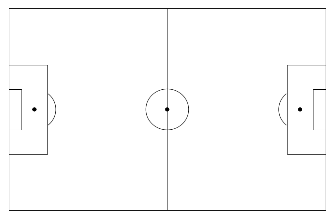


```python
import seaborn as sns

ax = sns.kdeplot(list(ronaldopos['xstart'])+list(ronaldopos['xstop']), list(ronaldopos['ystart'])+ list(ronaldopos['ystop']), shade= True, n_levels=15 ,kernel='cos' , cmap="Reds", shade_lowest=False)
ax1 = ax.twinx()
sns.kdeplot(list(messipos['xstart'])+list(messipos['xstop']), list(messipos['ystart'])+ list(messipos['ystop']), shade= False, n_levels=15 ,kernel='cos' , cmap="Blues", shade_lowest= False, ax = ax)
createPitch(ax1)
plt.title('Ronaldo & Messi position campare')
# plt.xticks([])
# plt.yticks([])
plt.ylim(-2, 92)
plt.xlim(-2, 132)
ax.axis('off')
plt.axis('off')
plt.show()
```


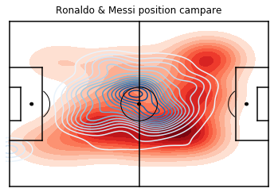


```python
# Ronaldo
import matplotlib.pyplot as plt
import seaborn as sns
fig = plt.figure(figsize=(12,8))
ax=fig.add_subplot(1,1,1)

ax1 = ax.twinx()

createPitch(ax1)
ax = sns.kdeplot(list(ronaldopos['xstart'])+list(ronaldopos['xstop']), list(ronaldopos['ystart'])+ list(ronaldopos['ystop']), shade="True", n_levels=15 ,kernel='cos' , cmap="Greens", ax =ax)

plt.axis('off')
ax.axis('off')

plt.ylim(-2, 92)
plt.xlim(-2, 132)
plt.show()
```


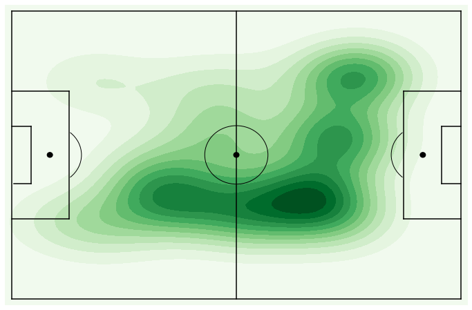


```python
# Messi
fig = plt.figure(figsize=(7,5))
ax=fig.add_subplot(1,1,1)

ax1 = ax.twinx()
sns.kdeplot(list(messipos['xstart'])+list(messipos['xstop']), list(messipos['ystart'])+ list(messipos['ystop']), shade="True", n_levels=15 ,kernel='cos' , cmap="Greens" , ax=ax)


#ax=fig.add_subplot(1,1,1)
draw_pitch(ax1) #overlay our different objects on the pitch

plt.ylim(-2, 82)
plt.xlim(-2, 122)
plt.axis('off')
ax.axis('off')

plt.show()
```


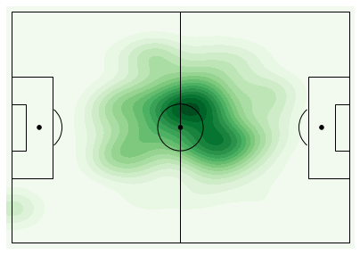


```python
# Messi
fig = plt.figure(figsize=(7,5))
ax = fig.add_subplot(1,1,1)

ax1 =ax.twinx()
ax = sns.kdeplot(list(messipos['xstart'])+list(messipos['xstop']), list(messipos['ystart'])+ list(messipos['ystop']), shade="True", n_levels=15 ,kernel='cos' , cmap="Greens", ax =ax)
 #overlay our different objects on the pitch

draw_pitch(ax1)

plt.ylim(-1, 81)
plt.xlim(-1, 121)
plt.axis('off')
ax.axis('off')

plt.show()
```


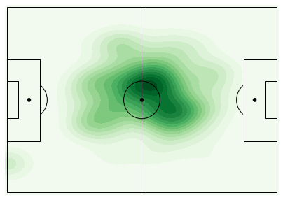


```python
# Messi

fig=plt.figure() #set up the figures
fig.set_size_inches(10, 6)
ax=fig.add_subplot(1,1,1)


ax = sns.kdeplot(list(messipos['xstart'])+list(messipos['xstop']), list(messipos['ystart'])+ list(messipos['ystop']), shade="True", n_levels=15 ,kernel='cos' , cmap="Greens", ax =ax)
for i in messipos.index:
    # annotate draw an arrow from a current position to pass_end_location
    ax.annotate("", xy = (messipos['xstop'][i] , messipos['ystop'][i]), xycoords = 'data',
                   xytext = (messipos['xstart'][i] , messipos['ystart'][i]), textcoords = 'data',
                   arrowprops=dict(arrowstyle="->",connectionstyle="arc3", color = "blue"))

ax1 = ax.twinx()
draw_pitch(ax1)
plt.axis('off')
ax.axis('off')

plt.ylim(-1, 82)
plt.xlim(-1, 121)

plt.show()
```


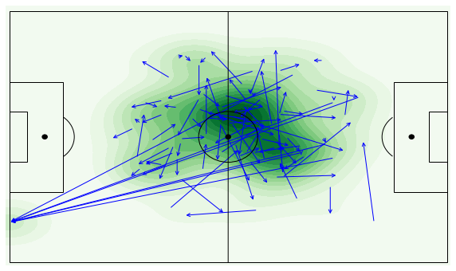


```python
plyer[plyer['firstName']=='Cristiano Ronaldo']['role']
```


    185    {'code2': 'FW', 'code3': 'FWD', 'name': 'Forwa...
    Name: role, dtype: object


```python
with open('matches_Italy.json') as json_file:
    itmatches = json.load(json_file)
    
with open('events_Italy.json') as json_file:
    itevent = json.load(json_file)

    
itmatch = pd.DataFrame(itmatches)
itevents = pd.DataFrame(itevent)  
```


```python
##   Juventus - Napoli played on the 22 April 2018
itmatch[itmatch['label']== "Juventus - Napoli, 0 - 1"]
```


<div>
<style scoped>
    .dataframe tbody tr th:only-of-type {
        vertical-align: middle;
    }

    .dataframe tbody tr th {
        vertical-align: top;
    }

    .dataframe thead th {
        text-align: right;
    }
</style>
<table border="1" class="dataframe">
  <thead>
    <tr style="text-align: right;">
      <th></th>
      <th>status</th>
      <th>roundId</th>
      <th>gameweek</th>
      <th>teamsData</th>
      <th>seasonId</th>
      <th>dateutc</th>
      <th>winner</th>
      <th>venue</th>
      <th>wyId</th>
      <th>label</th>
      <th>date</th>
      <th>referees</th>
      <th>duration</th>
      <th>competitionId</th>
    </tr>
  </thead>
  <tbody>
    <tr>
      <td>41</td>
      <td>Played</td>
      <td>4406278</td>
      <td>34</td>
      <td>{'3159': {'scoreET': 0, 'coachId': 20386, 'sid...</td>
      <td>181248</td>
      <td>2018-04-22 18:45:00</td>
      <td>3187</td>
      <td></td>
      <td>2576295</td>
      <td>Juventus - Napoli, 0 - 1</td>
      <td>April 22, 2018 at 8:45:00 PM GMT+2</td>
      <td>[{'refereeId': 377206, 'role': 'referee'}, {'r...</td>
      <td>Regular</td>
      <td>524</td>
    </tr>
  </tbody>
</table>
</div>


```python
itmatches[41]
```


    {'status': 'Played',
     'roundId': 4406278,
     'gameweek': 34,
     'teamsData': {'3159': {'scoreET': 0,
       'coachId': 20386,
       'side': 'home',
       'teamId': 3159,
       'score': 0,
       'scoreP': 0,
       'hasFormation': 1,
       'formation': {'bench': [{'playerId': 21128,
          'ownGoals': '2',
          'redCards': '0',
          'goals': '0',
          'yellowCards': '0'},
         {'playerId': 20458,
          'ownGoals': '2',
          'redCards': '0',
          'goals': '0',
          'yellowCards': '0'},
         {'playerId': 70084,
          'ownGoals': '2',
          'redCards': '0',
          'goals': '0',
          'yellowCards': '0'},
         {'playerId': 246061,
          'ownGoals': '2',
          'redCards': '0',
          'goals': '0',
          'yellowCards': '0'},
         {'playerId': 134427,
          'ownGoals': '2',
          'redCards': '0',
          'goals': '0',
          'yellowCards': '0'},
         {'playerId': 361807,
          'ownGoals': '2',
          'redCards': '0',
          'goals': '0',
          'yellowCards': '0'},
         {'playerId': 7849,
          'ownGoals': '2',
          'redCards': '0',
          'goals': '0',
          'yellowCards': '0'},
         {'playerId': 20465,
          'ownGoals': '2',
          'redCards': '0',
          'goals': '0',
          'yellowCards': '0'},
         {'playerId': 14943,
          'ownGoals': '2',
          'redCards': '0',
          'goals': '0',
          'yellowCards': '0'},
         {'playerId': 20751,
          'ownGoals': '2',
          'redCards': '0',
          'goals': '0',
          'yellowCards': '0'}],
        'lineup': [{'playerId': 20461,
          'ownGoals': '2',
          'redCards': '0',
          'goals': '0',
          'yellowCards': '0'},
         {'playerId': 89186,
          'ownGoals': '2',
          'redCards': '0',
          'goals': '0',
          'yellowCards': '0'},
         {'playerId': 105334,
          'ownGoals': '2',
          'redCards': '0',
          'goals': '0',
          'yellowCards': '0'},
         {'playerId': 20455,
          'ownGoals': '2',
          'redCards': '0',
          'goals': '0',
          'yellowCards': '0'},
         {'playerId': 20443,
          'ownGoals': '2',
          'redCards': '0',
          'goals': '0',
          'yellowCards': '27'},
         {'playerId': 3323,
          'ownGoals': '2',
          'redCards': '0',
          'goals': '0',
          'yellowCards': '0'},
         {'playerId': 20579,
          'ownGoals': '2',
          'redCards': '0',
          'goals': '0',
          'yellowCards': '9'},
         {'playerId': 25437,
          'ownGoals': '2',
          'redCards': '0',
          'goals': '0',
          'yellowCards': '0'},
         {'playerId': 3318,
          'ownGoals': '2',
          'redCards': '0',
          'goals': '0',
          'yellowCards': '0'},
         {'playerId': 20588,
          'ownGoals': '2',
          'redCards': '0',
          'goals': '0',
          'yellowCards': '9'},
         {'playerId': 14855,
          'ownGoals': '2',
          'redCards': '0',
          'goals': '0',
          'yellowCards': '0'}],
        'substitutions': [{'playerIn': 20465, 'playerOut': 20461, 'minute': 11},
         {'playerIn': 20751, 'playerOut': 89186, 'minute': 46},
         {'playerIn': 14943, 'playerOut': 105334, 'minute': 71}]},
       'scoreHT': 0},
      '3187': {'scoreET': 0,
       'coachId': 210252,
       'side': 'away',
       'teamId': 3187,
       'score': 1,
       'scoreP': 0,
       'hasFormation': 1,
       'formation': {'bench': [{'playerId': 300830,
          'ownGoals': '0',
          'redCards': '0',
          'goals': 'null',
          'yellowCards': '0'},
         {'playerId': 21173,
          'ownGoals': '0',
          'redCards': '0',
          'goals': 'null',
          'yellowCards': '0'},
         {'playerId': 40774,
          'ownGoals': '0',
          'redCards': '0',
          'goals': 'null',
          'yellowCards': '0'},
         {'playerId': 22817,
          'ownGoals': '0',
          'redCards': '0',
          'goals': 'null',
          'yellowCards': '0'},
         {'playerId': 288423,
          'ownGoals': '0',
          'redCards': '0',
          'goals': 'null',
          'yellowCards': '0'},
         {'playerId': 374013,
          'ownGoals': '0',
          'redCards': '0',
          'goals': 'null',
          'yellowCards': '0'},
         {'playerId': 83575,
          'ownGoals': '0',
          'redCards': '0',
          'goals': 'null',
          'yellowCards': '0'},
         {'playerId': 21006,
          'ownGoals': '0',
          'redCards': '0',
          'goals': 'null',
          'yellowCards': '0'},
         {'playerId': 69874,
          'ownGoals': '0',
          'redCards': '0',
          'goals': 'null',
          'yellowCards': '0'},
         {'playerId': 99902,
          'ownGoals': '0',
          'redCards': '0',
          'goals': 'null',
          'yellowCards': '0'},
         {'playerId': 99452,
          'ownGoals': '0',
          'redCards': '0',
          'goals': 'null',
          'yellowCards': '0'},
         {'playerId': 284315,
          'ownGoals': '0',
          'redCards': '0',
          'goals': 'null',
          'yellowCards': '0'}],
        'lineup': [{'playerId': 122,
          'ownGoals': '0',
          'redCards': '0',
          'goals': 'null',
          'yellowCards': '0'},
         {'playerId': 21171,
          'ownGoals': '0',
          'redCards': '0',
          'goals': 'null',
          'yellowCards': '0'},
         {'playerId': 40726,
          'ownGoals': '0',
          'redCards': '0',
          'goals': 'null',
          'yellowCards': '0'},
         {'playerId': 21385,
          'ownGoals': '0',
          'redCards': '0',
          'goals': 'null',
          'yellowCards': '0'},
         {'playerId': 21001,
          'ownGoals': '0',
          'redCards': '0',
          'goals': 'null',
          'yellowCards': '0'},
         {'playerId': 21315,
          'ownGoals': '0',
          'redCards': '0',
          'goals': 'null',
          'yellowCards': '0'},
         {'playerId': 7949,
          'ownGoals': '0',
          'redCards': '0',
          'goals': 'null',
          'yellowCards': '0'},
         {'playerId': 25726,
          'ownGoals': '0',
          'redCards': '0',
          'goals': '1',
          'yellowCards': '0'},
         {'playerId': 3300,
          'ownGoals': '2',
          'redCards': '0',
          'goals': '0',
          'yellowCards': '16'},
         {'playerId': 3313,
          'ownGoals': '0',
          'redCards': '0',
          'goals': 'null',
          'yellowCards': '0'},
         {'playerId': 22107,
          'ownGoals': '0',
          'redCards': '0',
          'goals': 'null',
          'yellowCards': '0'}],
        'substitutions': [{'playerIn': 99452, 'playerOut': 122, 'minute': 61},
         {'playerIn': 99902, 'playerOut': 21171, 'minute': 67},
         {'playerIn': 284315, 'playerOut': 40726, 'minute': 80}]},
       'scoreHT': 0}},
     'seasonId': 181248,
     'dateutc': '2018-04-22 18:45:00',
     'winner': 3187,
     'venue': '',
     'wyId': 2576295,
     'label': 'Juventus - Napoli, 0 - 1',
     'date': 'April 22, 2018 at 8:45:00 PM GMT+2',
     'referees': [{'refereeId': 377206, 'role': 'referee'},
      {'refereeId': 383492, 'role': 'firstAssistant'},
      {'refereeId': 384974, 'role': 'secondAssistant'},
      {'refereeId': 377247, 'role': 'fourthOfficial'}],
     'duration': 'Regular',
     'competitionId': 524}


```python
plyer[plyer['wyId']==21315]
```


<div>
<style scoped>
    .dataframe tbody tr th:only-of-type {
        vertical-align: middle;
    }

    .dataframe tbody tr th {
        vertical-align: top;
    }

    .dataframe thead th {
        text-align: right;
    }
</style>
<table border="1" class="dataframe">
  <thead>
    <tr style="text-align: right;">
      <th></th>
      <th>passportArea</th>
      <th>weight</th>
      <th>firstName</th>
      <th>middleName</th>
      <th>lastName</th>
      <th>currentTeamId</th>
      <th>birthDate</th>
      <th>height</th>
      <th>role</th>
      <th>birthArea</th>
      <th>wyId</th>
      <th>foot</th>
      <th>shortName</th>
      <th>currentNationalTeamId</th>
    </tr>
  </thead>
  <tbody>
    <tr>
      <td>1658</td>
      <td>{'name': 'Italy', 'id': '380', 'alpha3code': '...</td>
      <td>65</td>
      <td>Jorge Luiz</td>
      <td></td>
      <td>Frello Filho</td>
      <td>3187</td>
      <td>1991-12-20</td>
      <td>180</td>
      <td>{'code2': 'MD', 'code3': 'MID', 'name': 'Midfi...</td>
      <td>{'name': 'Brazil', 'id': '76', 'alpha3code': '...</td>
      <td>21315</td>
      <td>right</td>
      <td>Jorginho</td>
      <td>3757</td>
    </tr>
  </tbody>
</table>
</div>


```python
plyer[plyer['wyId']==20443]
```


<div>
<style scoped>
    .dataframe tbody tr th:only-of-type {
        vertical-align: middle;
    }

    .dataframe tbody tr th {
        vertical-align: top;
    }

    .dataframe thead th {
        text-align: right;
    }
</style>
<table border="1" class="dataframe">
  <thead>
    <tr style="text-align: right;">
      <th></th>
      <th>passportArea</th>
      <th>weight</th>
      <th>firstName</th>
      <th>middleName</th>
      <th>lastName</th>
      <th>currentTeamId</th>
      <th>birthDate</th>
      <th>height</th>
      <th>role</th>
      <th>birthArea</th>
      <th>wyId</th>
      <th>foot</th>
      <th>shortName</th>
      <th>currentNationalTeamId</th>
    </tr>
  </thead>
  <tbody>
    <tr>
      <td>1482</td>
      <td>{'name': 'Luxembourg', 'id': '442', 'alpha3cod...</td>
      <td>74</td>
      <td>Miralem</td>
      <td></td>
      <td>Pjani\u0107</td>
      <td>3159</td>
      <td>1990-04-02</td>
      <td>180</td>
      <td>{'code2': 'MD', 'code3': 'MID', 'name': 'Midfi...</td>
      <td>{'name': 'Bosnia-Herzegovina', 'id': '70', 'al...</td>
      <td>20443</td>
      <td>right</td>
      <td>M. Pjani\u0107</td>
      <td>null</td>
    </tr>
  </tbody>
</table>
</div>


```python
Jorginho = itevents[(itevents['playerId']==21315)& (itevents['matchId']==2576295)& (itevents['eventId']==8)]
Pjanic = itevents[(itevents['playerId']==20443)& (itevents['matchId']==2576295)& (itevents['eventId']==8)] 
```


```python
import numpy as np
Jorginhoaccurate  = position(Jorginho[Jorginho['tags'].apply(lambda x: len([k for k in x if k['id']==1801]))==0]['positions'])
Pjanicaccurate = position(Pjanic[Pjanic['tags'].apply(lambda x: len([k for k in x if k['id']==1801]))==0]['positions'])
```


```python
jorginhopos = position(Jorginho['positions'])
pjanicpos = position(Pjanic['positions'])
```


```python
# jorginho

import seaborn as sns

fig=plt.figure(figsize= (10, 6)) #set up the figures
#fig.set_size_inches(7, 5)
ax=fig.add_subplot(1,1,1)

ax = sns.kdeplot(list(jorginhopos['xstart'])+list(jorginhopos['xstop']), list(jorginhopos['ystart'])+ list(jorginhopos['ystop']), shade="True", n_levels=15 ,kernel='cos' , cmap="Greens", ax= ax)
for i in jorginhopos.index:
    # annotate draw an arrow from a current position to pass_end_location
    ax.annotate("", xy = (jorginhopos['xstop'][i] , jorginhopos['ystop'][i]), xycoords = 'data',
                   xytext = (jorginhopos['xstart'][i] , jorginhopos['ystart'][i]), textcoords = 'data',
                   arrowprops=dict(arrowstyle="->",connectionstyle="arc3", color = "blue"))


ax1 = ax.twinx()
#draw_pitch(ax1)
createPitch(ax1)
plt.tight_layout()
plt.ylim(-1, 90)
plt.xlim(-1, 131)
plt.axis('off')
ax.axis('off')
plt.show()
```

    C:\ProgramData\Anaconda3\lib\site-packages\ipykernel_launcher.py:20: UserWarning: Tight layout not applied. The left and right margins cannot be made large enough to accommodate all axes decorations. 
    


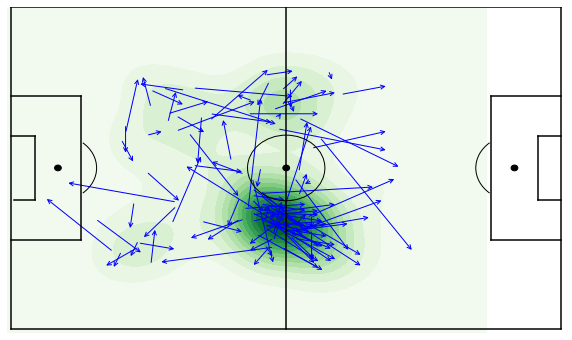


```python
# pjanic
import matplotlib
fig=plt.figure(figsize=(7,5)) #set up the figures
#fig.set_size_inches(7, 5)
ax=fig.add_subplot(1,1,1)
#ax1 = ax.twinx()

sns.kdeplot(list(pjanicpos['xstart'])+list(pjanicpos['xstop']), list(pjanicpos['ystart'])+ list(pjanicpos['ystop']), shade="True", n_levels=15 ,kernel='cos' , cmap="Greens")
for i in pjanicpos.index:
    # annotate draw an arrow from a current position to pass_end_location
    ax.annotate("", xy = (pjanicpos['xstop'][i] , pjanicpos['ystop'][i]), xycoords = 'data',
                   xytext = (pjanicpos['xstart'][i] , pjanicpos['ystart'][i]), textcoords = 'data',
                   arrowprops=dict(arrowstyle="->",connectionstyle="arc3", color = "blue"))

#plt.gca().set_aspect('auto', 'datalim')
draw_pitch(ax)
#createPitch(ax)
#draw_pitch(ax)
# ax.axis('scaled')
#plt.imshow(img)
# plt.tight_layout()
plt.ylim(-1,82)
plt.xlim(-1, 130)
#plt.tight_layout()
#matplotlib.axes.Axes.set_aspect(ax ,aspect ='auto', adjustable='box', anchor='C')
#plt.gca().set_aspect(aspect ='auto')
#ax.autoscale(enable=True)
#ax.relim()
plt.axis('off')
plt.show()
```


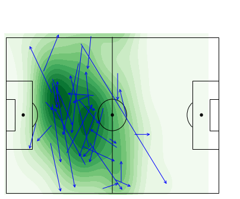


```python
# compare the pass between two players

fig=plt.figure() #set up the figures
fig.set_size_inches(7, 5)
ax=fig.add_subplot(1,1,1)
ax1 = ax.twinx()
sns.kdeplot(list(jorginhopos['xstart'])+list(jorginhopos['xstop']), list(jorginhopos['ystart'])+ list(jorginhopos['ystop']), shade=True, n_levels=15 ,kernel='cos' , cmap="Greens" , ax =ax)
sns.kdeplot(list(pjanicpos['xstart'])+list(pjanicpos['xstop']), list(pjanicpos['ystart'])+ list(pjanicpos['ystop']), shade=False , n_levels=15 ,kernel='cos' , cmap="Reds", ax =ax)

for i in jorginhopos.index:
    try:
        # annotate draw an arrow from a current position to pass_end_location
        ax.annotate("", xy = (jorginhopos['xstop'][i] , jorginhopos['ystop'][i]), xycoords = 'data',
                       xytext = (jorginhopos['xstart'][i] , jorginhopos['ystart'][i]), textcoords = 'data',
                       arrowprops=dict(arrowstyle="->",connectionstyle="arc3", color = "y"))


        ax.annotate("", xy = (pjanicpos['xstop'][i] , pjanicpos['ystop'][i]), xycoords = 'data',
                       xytext = (pjanicpos['xstart'][i] , pjanicpos['ystart'][i]), textcoords = 'data',
                       arrowprops=dict(arrowstyle="->",connectionstyle="arc3", color = "blue"))    
    
    except:
        pass
    
draw_pitch(ax1)
plt.axis('off')
plt.ylim(-1,82)
plt.xlim(-1, 130)
ax.axis('off')
plt.show()
```


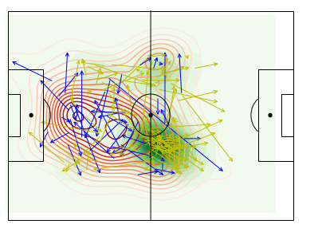


```python
# compare the pass between two players

fig=plt.figure() #set up the figures
fig.set_size_inches(12, 8)
ax=fig.add_subplot(1,1,1)

ax1 = ax.twinx()
sns.kdeplot(list(jorginhopos['xstart'])+list(jorginhopos['xstop']), list(jorginhopos['ystart'])+ list(jorginhopos['ystop']), shade=True, n_levels=15 ,kernel='cos' , cmap="Greens" , ax =ax)

for i in jorginhopos.index:
    
    # annotate draw an arrow from a current position to pass_end_location
    ax.annotate("", xy = (jorginhopos['xstop'][i] , jorginhopos['ystop'][i]), xycoords = 'data',
                   xytext = (jorginhopos['xstart'][i] , jorginhopos['ystart'][i]), textcoords = 'data',
                   arrowprops=dict(arrowstyle="->",connectionstyle="arc3", color = "blue"))

for j in Jorginhoaccurate.index:
        ax.annotate("", xy = (Jorginhoaccurate['xstop'][j] , Jorginhoaccurate['ystop'][j]), xycoords = 'data',
                       xytext = (Jorginhoaccurate['xstart'][j] , Jorginhoaccurate['ystart'][j]), textcoords = 'data',
                       arrowprops=dict(arrowstyle="->",connectionstyle="arc3", color = "red"))    
    
    
draw_pitch(ax1)
plt.axis('off')
plt.ylim(-1,82)
plt.xlim(-1, 130)
ax.axis('off')
plt.show()
```


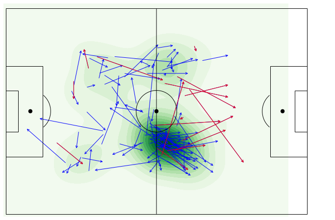


```python
fig=plt.figure() #set up the figures
fig.set_size_inches(12, 8)
ax=fig.add_subplot(1,1,1)
ax1 = ax.twinx()
sns.kdeplot(list(pjanicpos['xstart'])+list(pjanicpos['xstop']), list(pjanicpos['ystart'])+ list(pjanicpos['ystop']), shade=True, n_levels=15 ,kernel='cos' , cmap="Greens", ax =ax)

    
for i in pjanicpos.index:
    # annotate draw an arrow from a current position to pass_end_location
    ax.annotate("", xy = (pjanicpos['xstop'][i] , pjanicpos['ystop'][i]), xycoords = 'data',
                   xytext = (pjanicpos['xstart'][i] , pjanicpos['ystart'][i]), textcoords = 'data',
                   arrowprops=dict(arrowstyle="->",connectionstyle="arc3", color = "blue"))

for j in Pjanicaccurate.index:
    ax.annotate("", xy = (Pjanicaccurate['xstop'][j] , Pjanicaccurate['ystop'][j]), xycoords = 'data',
                   xytext = (Pjanicaccurate['xstart'][j] , Pjanicaccurate['ystart'][j]), textcoords = 'data',
                   arrowprops=dict(arrowstyle="->",connectionstyle="arc3", color = "red"))    

draw_pitch(ax1)
plt.axis('off')
plt.ylim(-1,82)
plt.xlim(-1, 130)
ax.axis('off')
plt.show()
```


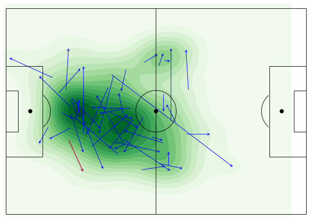

